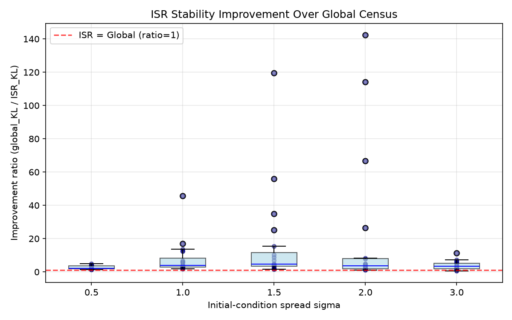

# Inflationary Sector Renormalization — Summary

## Run Metadata

- **01_global_census_baseline**: n_traj=10000, seed=42, phi0=2.0, landscape_hash=17422568b638
- **02_locality_weighted_measure**: n_traj=10000, seed=42, phi0=2.0, landscape_hash=17422568b638
- **03_cutoff_stability**: n_traj=10000, seed=42, phi0=2.0, landscape_hash=17422568b638
- **04_kernel_sensitivity**: n_traj=10000, seed=42, phi0=2.0, landscape_hash=17422568b638
- **05_basin_boundary_test**: n_traj=10000, seed=42, phi0=2.0, landscape_hash=17422568b638
- **06_bell_locality_diagnostic**: n_traj=10000, seed=42, phi0=2.0, landscape_hash=17422568b638
- **07_effective_action_coefficients**: n_traj=10000, seed=42, phi0=2.0, landscape_hash=17422568b638
- **08_stress_test**: n_traj=2000, seed=[1..20], phi0=2.0, landscape_hash=17422568b638

## 01 — Global Census Baseline

- KL divergence at max cutoff: 0.0003581783760729

## 02 — ISR Locality-Weighted Measure

- Kernel: gaussian, ell=1.0

- KL divergence at max cutoff: 0.00012725910084830286

## 03 — Kernel Comparison (Cutoff Stability)

### Evidence Kernels

| type     | kernel      |   ell | measure   |     kl_last |   wasserstein_last | stability   |
|:---------|:------------|------:|:----------|------------:|-------------------:|:------------|
| evidence | gaussian    |  0.1  | ISR       | 0           |        1.88687e-33 | good        |
| evidence | gaussian    |  0.25 | ISR       | 1.93574e-09 |        2.06521e-08 | good        |
| evidence | gaussian    |  0.5  | ISR       | 2.66338e-06 |        0.000326996 | good        |
| evidence | gaussian    |  1    | ISR       | 0.000127259 |        0.00641025  | good        |
| evidence | gaussian    |  2    | ISR       | 0.000222296 |        0.00849626  | good        |
| evidence | exponential |  0.1  | ISR       | 3.85435e-09 |        1.39728e-07 | good        |
| evidence | exponential |  0.25 | ISR       | 3.20876e-06 |        0.000303928 | good        |
| evidence | exponential |  0.5  | ISR       | 5.23394e-05 |        0.00311154  | good        |
| evidence | exponential |  1    | ISR       | 0.000143728 |        0.00672448  | good        |
| evidence | exponential |  2    | ISR       | 0.000212019 |        0.00824901  | good        |

### Diagnostic-Only Kernels

| type       | kernel         |   ell | measure   |     kl_last |   wasserstein_last | stability   |
|:-----------|:---------------|------:|:----------|------------:|-------------------:|:------------|
| diagnostic | ancestry_proxy |     1 | ISR       | 0.000358178 |             0.0093 | good        |
| diagnostic | ancestry_proxy |     2 | ISR       | 0.000358178 |             0.0093 | good        |
| diagnostic | ancestry_proxy |     3 | ISR       | 0.000358178 |             0.0093 | good        |
| diagnostic | ancestry_proxy |     5 | ISR       | 0.000358178 |             0.0093 | good        |
| diagnostic | ancestry_proxy |    10 | ISR       | 0.000358178 |             0.0093 | good        |
| diagnostic | same_basin     |     1 | ISR       | 0           |             0      | good        |

### Baseline

| type     |   kernel |   ell | measure       |     kl_last |   wasserstein_last | stability   |
|:---------|---------:|------:|:--------------|------------:|-------------------:|:------------|
| baseline |      nan |   nan | global_census | 0.000358178 |             0.0093 | good        |

## 04 — Kernel Sensitivity

### Evidence

| Kernel | mean_KL |
|--------|--------|

| gaussian_ell0.1 | 0.0000 |

| gaussian_ell0.25 | 0.0000 |

| gaussian_ell0.5 | 0.0003 |

| gaussian_ell1.0 | 0.0032 |

| gaussian_ell2.0 | 0.0047 |

| exponential_ell0.1 | 0.0000 |

| exponential_ell0.25 | 0.0003 |

| exponential_ell0.5 | 0.0018 |

| exponential_ell1.0 | 0.0035 |

| exponential_ell2.0 | 0.0046 |

### Diagnostic

| Kernel | mean_KL |
|--------|--------|

| ancestry_proxy_ell1 | 0.0066 |

| ancestry_proxy_ell2 | 0.0066 |

| ancestry_proxy_ell3 | 0.0066 |

| ancestry_proxy_ell5 | 0.0066 |

| ancestry_proxy_ell10 | 0.0066 |

| same_basin_ell1 | 0.0000 |

## 05 — Basin Boundary Test

- Thresholds scanned: 18

- At largest threshold (d<=3.0):

  - Same-basin pairs: 3586.0, θ-dist=0.0000

  - Diff-basin pairs: 5826.0, θ-dist=30.3824

  - Mean θ-to-x0 (same): 0.0000

  - Mean θ-to-x0 (diff): 102.4274

## 06 — Bell Locality Diagnostic

| distance_key | threshold | continuity | basin_exception | locality_failure | near_same | near_diff |

|--------------|-----------|------------|-----------------|-----------------|-----------|-----------|

| basin_transition | thr_0.1 | 1.000 | 0.000 | 0.000 | 15935 | 0 |

| basin_transition | thr_0.25 | 1.000 | 0.000 | 0.000 | 15935 | 0 |

| basin_transition | thr_0.5 | 1.000 | 0.000 | 0.000 | 15935 | 0 |

| basin_transition | thr_1.0 | 1.000 | 0.000 | 0.000 | 15935 | 0 |

| basin_transition | thr_1.5 | 1.000 | 0.681 | 0.000 | 15935 | 34060 |

| basin_transition | thr_2.0 | 1.000 | 0.681 | 0.000 | 15935 | 34060 |

| phi | thr_0.1 | 1.000 | 0.000 | 0.000 | 10050 | 0 |

| phi | thr_0.25 | 1.000 | 0.000 | 0.000 | 15390 | 0 |

| phi | thr_0.5 | 1.000 | 0.000 | 0.000 | 15906 | 0 |

| phi | thr_1.0 | 1.000 | 0.007 | 0.000 | 15935 | 112 |

| phi | thr_1.5 | 1.000 | 0.263 | 0.000 | 15935 | 5692 |

| phi | thr_2.0 | 1.000 | 0.483 | 0.000 | 15935 | 14911 |

| phi_initial | thr_0.1 | 1.000 | 0.054 | 0.000 | 1732 | 98 |

| phi_initial | thr_0.25 | 1.000 | 0.090 | 0.000 | 4196 | 414 |

| phi_initial | thr_0.5 | 1.000 | 0.161 | 0.000 | 7778 | 1496 |

| phi_initial | thr_1.0 | 1.000 | 0.297 | 0.000 | 12735 | 5385 |

| phi_initial | thr_1.5 | 1.000 | 0.424 | 0.000 | 14980 | 11017 |

| phi_initial | thr_2.0 | 1.000 | 0.519 | 0.000 | 15748 | 16965 |

## 07 — Effective Action Coefficients

### ell_0.1

- Lambda_eff_vac3: 2.0000

- Lambda_eff_vac2: 0.0000

- Lambda_eff_vac4: 0.0000

- Lambda_eff_vac1: 0.0000

- Lambda_eff_vac5: 0.0000

- Lambda_eff_vac0: 0.0000

- Lambda_eff_aggregate: 2.0000

- G_eff_vac3: 0.7000

- G_eff_vac2: 0.0000

- G_eff_vac4: 0.0000

- G_eff_vac1: 0.0000

- G_eff_vac5: 0.0000

- G_eff_vac0: 0.0000

- G_eff_aggregate: 0.7000

- Q_fluctuation_vac3: 0.1000

- Q_fluctuation_vac2: 0.0000

- Q_fluctuation_vac4: 0.0000

- Q_fluctuation_vac1: 0.0000

- Q_fluctuation_vac5: 0.0000

- Q_fluctuation_vac0: 0.0000

- Q_fluctuation_aggregate: 0.1000

- reheating_temp_vac3: 200.0000

- reheating_temp_vac2: 0.0000

- reheating_temp_vac4: 0.0000

- reheating_temp_vac1: 0.0000

- reheating_temp_vac5: 0.0000

- reheating_temp_vac0: 0.0000

- reheating_temp_aggregate: 200.0000

### ell_0.25

- Lambda_eff_vac3: 2.0000

- Lambda_eff_vac2: 0.0000

- Lambda_eff_vac4: 0.0000

- Lambda_eff_vac1: 0.0000

- Lambda_eff_vac5: 0.0000

- Lambda_eff_vac0: 0.0000

- Lambda_eff_aggregate: 2.0000

- G_eff_vac3: 0.7000

- G_eff_vac2: 0.0000

- G_eff_vac4: 0.0000

- G_eff_vac1: 0.0000

- G_eff_vac5: 0.0000

- G_eff_vac0: 0.0000

- G_eff_aggregate: 0.7000

- Q_fluctuation_vac3: 0.1000

- Q_fluctuation_vac2: 0.0000

- Q_fluctuation_vac4: 0.0000

- Q_fluctuation_vac1: 0.0000

- Q_fluctuation_vac5: 0.0000

- Q_fluctuation_vac0: 0.0000

- Q_fluctuation_aggregate: 0.1000

- reheating_temp_vac3: 199.9999

- reheating_temp_vac2: 0.0000

- reheating_temp_vac4: 0.0000

- reheating_temp_vac1: 0.0000

- reheating_temp_vac5: 0.0000

- reheating_temp_vac0: 0.0000

- reheating_temp_aggregate: 200.0000

### ell_0.5

- Lambda_eff_vac3: 1.9570

- Lambda_eff_vac2: 0.0240

- Lambda_eff_vac4: 0.0008

- Lambda_eff_vac1: 0.0000

- Lambda_eff_vac5: 0.0000

- Lambda_eff_vac0: 0.0000

- Lambda_eff_aggregate: 1.9817

- G_eff_vac3: 0.6850

- G_eff_vac2: 0.0220

- G_eff_vac4: 0.0020

- G_eff_vac1: 0.0000

- G_eff_vac5: 0.0000

- G_eff_vac0: 0.0000

- G_eff_aggregate: 0.7089

- Q_fluctuation_vac3: 0.0979

- Q_fluctuation_vac2: 0.0080

- Q_fluctuation_vac4: 0.0014

- Q_fluctuation_vac1: 0.0000

- Q_fluctuation_vac5: 0.0000

- Q_fluctuation_vac0: 0.0000

- Q_fluctuation_aggregate: 0.1072

- reheating_temp_vac3: 195.7000

- reheating_temp_vac2: 2.3995

- reheating_temp_vac4: 0.0752

- reheating_temp_vac1: 0.0000

- reheating_temp_vac5: 0.0000

- reheating_temp_vac0: 0.0000

- reheating_temp_aggregate: 198.1747

### ell_1.0

- Lambda_eff_vac3: 1.3236

- Lambda_eff_vac2: 0.3177

- Lambda_eff_vac4: 0.0366

- Lambda_eff_vac1: 0.0002

- Lambda_eff_vac5: 0.0000

- Lambda_eff_vac0: 0.0000

- Lambda_eff_aggregate: 1.6781

- G_eff_vac3: 0.4633

- G_eff_vac2: 0.2912

- G_eff_vac4: 0.0952

- G_eff_vac1: 0.0002

- G_eff_vac5: 0.0000

- G_eff_vac0: 0.0000

- G_eff_aggregate: 0.8499

- Q_fluctuation_vac3: 0.0662

- Q_fluctuation_vac2: 0.1059

- Q_fluctuation_vac4: 0.0659

- Q_fluctuation_vac1: 0.0002

- Q_fluctuation_vac5: 0.0000

- Q_fluctuation_vac0: 0.0000

- Q_fluctuation_aggregate: 0.2381

- reheating_temp_vac3: 132.3623

- reheating_temp_vac2: 31.7690

- reheating_temp_vac4: 3.6608

- reheating_temp_vac1: 0.0166

- reheating_temp_vac5: 0.0032

- reheating_temp_vac0: 0.0000

- reheating_temp_aggregate: 167.8119

### ell_2.0

- Lambda_eff_vac3: 0.8924

- Lambda_eff_vac2: 0.4582

- Lambda_eff_vac4: 0.0784

- Lambda_eff_vac1: 0.0098

- Lambda_eff_vac5: 0.0044

- Lambda_eff_vac0: 0.0000

- Lambda_eff_aggregate: 1.4432

- G_eff_vac3: 0.3123

- G_eff_vac2: 0.4200

- G_eff_vac4: 0.2038

- G_eff_vac1: 0.0110

- G_eff_vac5: 0.0025

- G_eff_vac0: 0.0000

- G_eff_aggregate: 0.9497

- Q_fluctuation_vac3: 0.0446

- Q_fluctuation_vac2: 0.1527

- Q_fluctuation_vac4: 0.1411

- Q_fluctuation_vac1: 0.0098

- Q_fluctuation_vac5: 0.0015

- Q_fluctuation_vac0: 0.0000

- Q_fluctuation_aggregate: 0.3497

- reheating_temp_vac3: 89.2426

- reheating_temp_vac2: 45.8204

- reheating_temp_vac4: 7.8392

- reheating_temp_vac1: 0.9792

- reheating_temp_vac5: 0.4081

- reheating_temp_vac0: 0.0011

- reheating_temp_aggregate: 144.2906

## 08 — Stress Test (sigma × seed, n_traj=2000)

| sigma | global KL | ISR KL | improv. ratio | global W | ISR W | mean_alpha | n_vacua |

|-------|-----------|--------|--------------|----------|-------|------------|---------|

| 0.5 | 0.0008 | 0.0003 | 2.7x | 0.0121 | 0.0063 | 1.8713 | 3.0 |

| 1.0 | 0.0013 | 0.0003 | 7.9x | 0.0169 | 0.0086 | 1.7630 | 4.7 |

| 1.5 | 0.0012 | 0.0003 | 15.9x | 0.0206 | 0.0090 | 1.6752 | 6.0 |

| 2.0 | 0.0011 | 0.0003 | 20.2x | 0.0251 | 0.0102 | 1.6224 | 6.0 |

| 3.0 | 0.0010 | 0.0004 | 3.8x | 0.0313 | 0.0126 | 1.5704 | 6.0 |

### Failure Cases (ISR underperforms global)

| sigma | seed | ISR KL | global KL | ratio |

|-------|------|--------|-----------|-------|

| 3.0 | 13 | 0.0007 | 0.0005 | 0.68 |

| 3.0 | 14 | 0.0012 | 0.0010 | 0.89 |

